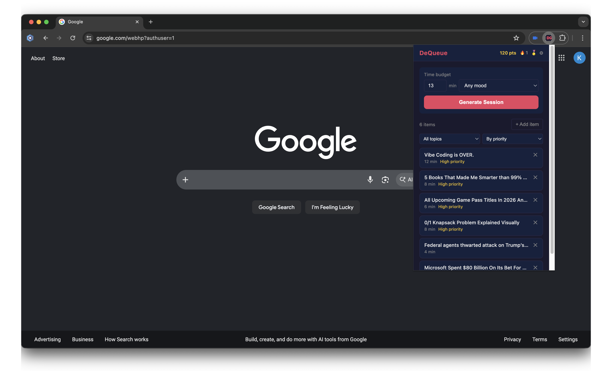
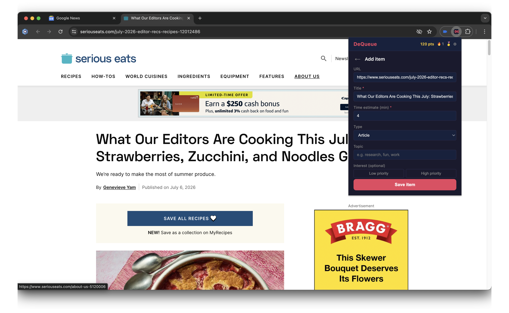
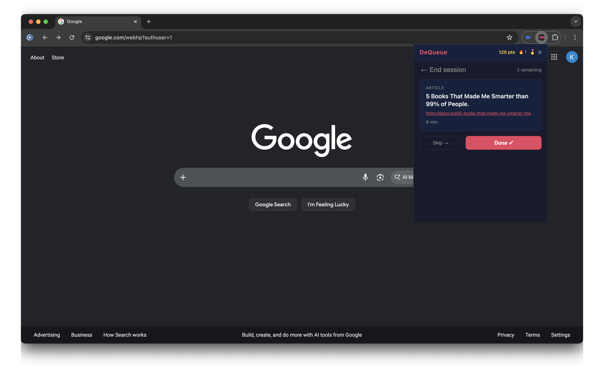
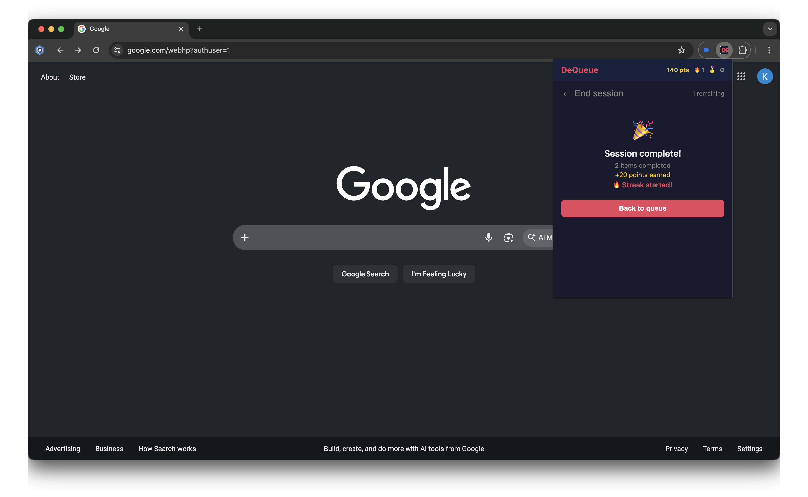
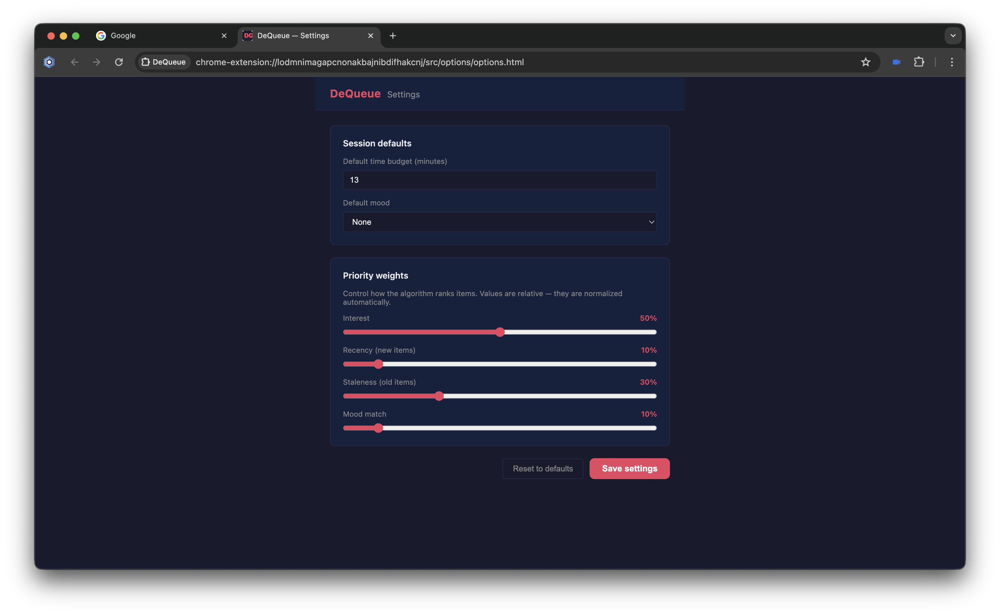

# DeQueue


A browser extension that helps people with ADHD manage content backlogs. You set a time budget, DeQueue uses a 0/1 knapsack algorithm to pick the highest-priority items that fit, and presents them one at a time so there's no choice paralysis.

Built for CS 398 — Algorithmic Problem Solving.

---

## What it does

- Save articles, videos, and links you want to get to
- Set a time budget (e.g. "I have 20 minutes")
- DeQueue selects the best items using a dynamic programming knapsack algorithm
- Items are presented one at a time — Done marks it complete, Skip cycles it to the back
- Priority scoring weighs interest rating, recency, staleness, and current mood
- Streak tracking keeps a running count of your daily session completions
- Achievements unlock as you hit milestones and surface as toast notifications
- Options page lets you configure default time budget and scoring weights

---

## Screenshots

| Queue | Add item |
| --- | --- |
|  |  |

| Session | Session complete |
| --- | --- |
|  |  |

| Settings |
| --- |
|  |

---

## Algorithm

DeQueue's session generator is a **0/1 knapsack** solved with bottom-up dynamic programming — the core algorithmic idea the whole project is built around. For full implementation details see the [design document § Core Algorithm](docs/design_documentation/DeQueue.md#3-core-algorithm).

### Problem mapping

| Knapsack concept | DeQueue meaning                          |
| ---------------- | ---------------------------------------- |
| Capacity         | Your time budget in minutes (max 60)     |
| Item weight      | Estimated read/watch time in minutes     |
| Item value       | Priority score from `scoring.js`         |
| Selected set     | The items DeQueue picks for your session |

### Priority scoring

Before the knapsack runs, every item gets a priority score (0–100) computed from four factors, each normalized to `[0, 1]` so no single factor dominates by scale:

- **Interest** — optional Low/Neutral/High toggle (defaults to neutral if skipped) → `(rating - 1) / 2`
- **Recency** — items added today score 1.0, decaying linearly to 0 at 30 days
- **Staleness** — inverse of recency; oldest items get a boost so nothing sits forever
- **Mood bias** — session-time-only mood picker (no per-item mood tag); "low-energy"/"fun" favor shorter items, "focus"/"curious" favor higher-interest items, no mood selected stays neutral

Weights are user-configurable via the options page. The default weights are intentionally asymmetric between recency and staleness — equal weights cancel each other out and produce no age-based differentiation.

### DP table

```text
Items →  i=0   i=1   i=2  ...  i=n
        ┌─────┬─────┬─────┬─────┐
w=0     │  0  │  0  │  0  │  0  │
w=1     │  0  │  v1 │  v1 │ ... │
w=2     │  0  │  v1 │  v2 │ ... │
 ...    │ ... │ ... │ ... │ ... │
w=W     │  0  │ ... │ ... │best │
        └─────┴─────┴─────┴─────┘
```

The table is 2D (`dp[i][w]`) rather than the space-optimized 1D rolling array — backtracking to recover _which_ items were selected (not just the best total value) requires the full row history. With a 60-minute cap the table stays at most `n × 60` cells, so memory is not a concern.

### Complexity

- **Time:** O(n × W) — effectively O(n) since W is fixed at 60
- **Space:** O(n × W) for the 2D table

### Correctness verification

`knapsackBruteForce` is exported alongside the DP solution and checks all `2ⁿ` subsets. It is used in the test suite to verify the DP result matches brute-force on small inputs, giving strong correctness guarantees without relying on hand-computed expected values.

---

## Planned features

### P2 — Near-term

- **JSON export / import** — back up your queue to a file and restore it on a new browser or after a reset
- **Topic clustering** — auto-group items by topic using a graph/similarity approach; this is where graph theory from the original design comes back in
- **Scoring weight tuning** — expose the recency vs. staleness tradeoff as a user-facing bias slider so users can tune "prefer new saves ↔ clear old backlog"
- **Safari support** — WebExtensions API is largely compatible; needs testing and a possible manifest tweak
- **Article / video only mode** — filter sessions to one content type (e.g. no audio at work)
- **Long-form mode** — handle items over 60 minutes; useful for painting tutorials or long documentaries on a free afternoon

### P3 — Stretch

- **Auto-import** — pull saved items from Pocket, Instapaper, Readwise, or YouTube Watch Later
- **Auto-remove from source** — after marking an item done, optionally archive it in Pocket, Instapaper, or YouTube Watch Later so your external lists stay clean too
- **Calendar integration** — detect free time blocks in Google Calendar and pre-generate a session that fits the next gap
- **Item organization** — folder hierarchy or directory view for large queues
- **Algorithm visualizer** — watch the DP table fill in real time as a session generates; useful for demos and explaining the algorithm
- **User stats dashboard** — total items completed, minutes consumed, streaks, most-read topics; surfaces progress to counter the guilt from a growing backlog
- **Weight experimentation UI** — expose recency, staleness, and other scoring factors as tunable sliders so users can discover what weighting pattern actually matches how their brain prioritizes
- **Long-form library** — a separate space for items over 60 minutes (tutorials, documentaries, deep-dives) that sits outside the main knapsack; when you have a big block of free time, DeQueue surfaces what's waiting there so you don't have to make that call yourself

---

## Project structure

```plaintext
src/
├── manifest.json              # WebExtensions MV3 config
├── background/
│   └── background.js          # Service worker — relays messages between popup and content script
├── content/
│   ├── content.js             # Injected into active tabs — scrapes page metadata to pre-fill the add form
│   └── content.test.js
├── popup/
│   ├── popup.html             # Extension popup UI (queue list, add item, session views)
│   ├── popup.js               # Popup logic — wires storage, scoring, knapsack, and queue together
│   └── popup.css
├── options/
│   ├── options.html           # Settings page — default budget, scoring weights, default mood
│   ├── options.js
│   └── options.css
├── core/
│   ├── knapsack.js            # 0/1 knapsack DP — selects which items fit the time budget
│   ├── knapsack.test.js
│   ├── queue.js               # SessionQueue — presents knapsack output one item at a time
│   ├── queue.test.js
│   └── pipeline.test.js       # Full pipeline integration + stress tests
└── utils/
    ├── scoring.js             # Priority score function (interest, recency, staleness, mood)
    ├── scoring.test.js
    ├── storage.js             # localStorage wrapper — single place for all reads and writes
    ├── storage.test.js
    ├── achievements.js        # Achievement definitions and unlock logic
    └── achievements.test.js
```

---

## Running locally

> **Note:** This is a browser extension — it cannot run in Codespaces, StackBlitz, or any other cloud-based environment. It must be loaded into a local browser using developer mode.

**Don't want to build from source?** Download the latest release zip from the [Releases page](../../releases), unzip it, and load the `dist/` folder directly in your browser. Skip to step 3 below.

---

**Prerequisites:** Node.js 18+, Chrome, Brave, or Firefox

**1. Install dependencies:**

```bash
npm install
```

**2. Build the extension:**

```bash
npm run build
```

This outputs the built extension to the `dist/` folder.

**3. Load the extension in your browser:**

**Chrome / Brave:**

1. Go to `chrome://extensions`
2. Enable **Developer mode** (toggle in the top right)
3. Click **Load unpacked**
4. Select the `dist/` folder

**Firefox:**

1. Go to `about:debugging` → **This Firefox**
2. Click **Load Temporary Add-on**
3. Select `dist/manifest.json`

**4. Use the extension:**

Click the DeQueue icon in your browser toolbar to open the popup. Navigate to any article or video, open the popup, and use **Add Item** to save it — the form will pre-fill from the page.

---

**Development (watch mode):**

```bash
npm run dev
```

Rebuilds automatically on every file save. After each rebuild, click the refresh icon on the DeQueue card in `chrome://extensions` to reload it in the browser.

**Run tests:**

```bash
npm test
```

**Test watch mode:**

```bash
npm run test:watch
```

---

## Tests

157 tests across 7 files, all passing. See [design document § Testing Plan](docs/design_documentation/DeQueue.md#9-testing-plan) for rationale on what is and isn't unit tested.

| File                         | Tests | What it covers                                                                    |
| ---------------------------- | ----- | --------------------------------------------------------------------------------- |
| `core/knapsack.test.js`      | 17    | DP vs. brute-force agreement, edge cases, known optimal solutions                 |
| `utils/scoring.test.js`      | 17    | Each scoring factor in isolation, output range, weight system, immutability       |
| `utils/storage.test.js`      | 35    | All CRUD operations, settings merge, corrupt-data resilience, clearAll scoping    |
| `core/queue.test.js`         | 23    | peek/dequeue/skip/toArray, skip cycling, buildSessionQueue sort order             |
| `content/content.test.js`    | 42    | Metadata extraction (title, description, type, duration, topic), duration parsers |
| `core/pipeline.test.js`      | 13    | Full pipeline integration, stress tests at 50–100 items, performance              |
| `utils/achievements.test.js` | 10    | Achievement unlock conditions, duplicate prevention, empty-stats base case        |

---

## Tech

- **Runtime:** Browser extension (WebExtensions MV3), Firefox + Chrome/Brave
- **Algorithm:** 0/1 knapsack via bottom-up dynamic programming (ES2022, no dependencies)
- **Build:** Vite + vite-plugin-web-extension
- **Storage:** `localStorage` (items, settings, streak, achievements) + `chrome.storage.session` (active session state)
- **Tests:** Vitest, jsdom
- **Linting / formatting:** ESLint, Prettier

See [design document § Architecture Overview](docs/design_documentation/DeQueue.md#1-architecture-overview) for a full breakdown of the extension components and data flow.

---

## Documentation

| Document | Description |
| -------- | ----------- |
| [Design Document](docs/design_documentation/DeQueue.md) | Architecture, data model, algorithm, storage, UI/UX, testing plan, and decisions log |
| [Project Proposal](docs/proposal.md) | Original project proposal submitted for CS 398 |
| [Dev Log](docs/notes/dev_log.md) | Chronological record of decisions and bugs as the project was built |
| [Idea Brainstorm](docs/notes/idea_brainstorm.md) | Original brainstorm, P0/P1/P2 feature tracking, and hallway testing notes |
| [Reflection Notes](docs/notes/reflection_notes.md) | Notes for the final reflection paper and project defense |
| [AI Use Log](docs/notes/ai_use_log.md) | Transparent record of how AI assistance was used, what it contributed, and where human judgment was required |
